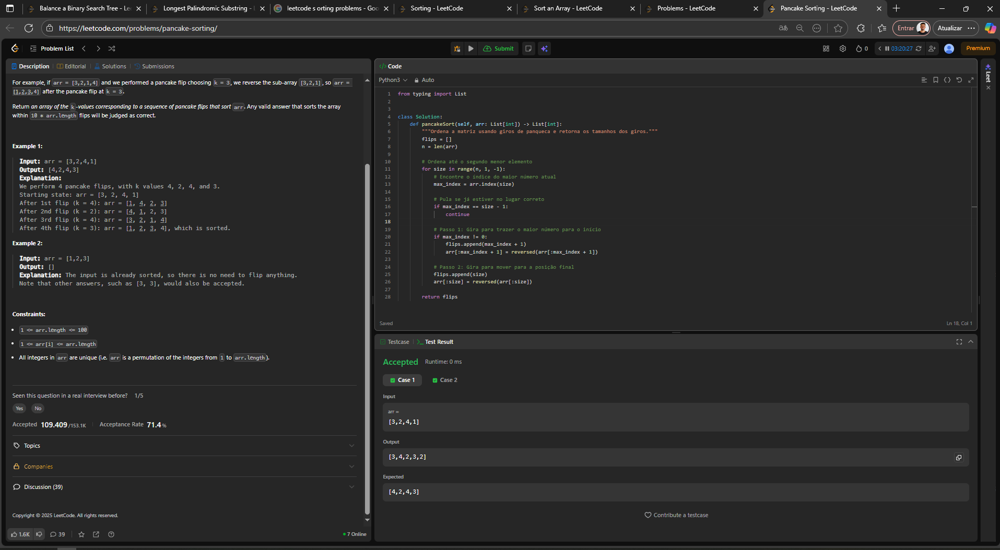
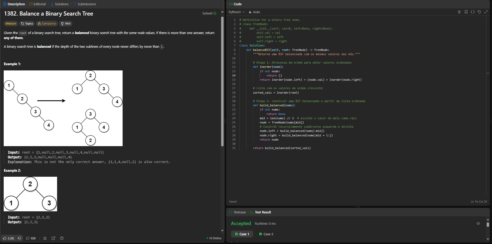

# Trabalho_Ordenacao_Grupo42

### Trabalho 02 - 13/10/2025

## Aluno 
| Matrícula | Nome |  
|-----------------------|---------------------|  
| 18/0113097 | Daniel Coimbra dos Santos |  

## Descrição do projeto
Resolução de questões do LeetCode para demonstrar na prática os conhecimentos adquiridos acerca do conteúdo Algoritmos de Busca

### Questão de Dificuldade Média:
#### 969. Pancake Sorting
Given an array of integers arr, sort the array by performing a series of pancake flips.

In one pancake flip we do the following steps:

Choose an integer k where 1 <= k <= arr.length.
Reverse the sub-array arr[0...k-1] (0-indexed).
For example, if arr = [3,2,1,4] and we performed a pancake flip choosing k = 3, we reverse the sub-array [3,2,1], so arr = [1,2,3,4] after the pancake flip at k = 3.

Return an array of the k-values corresponding to a sequence of pancake flips that sort arr. Any valid answer that sorts the array within 10 * arr.length flips will be judged as correct.

Constraints:

1 <= arr.length <= 100
1 <= arr[i] <= arr.length
All integers in arr are unique (i.e. arr is a permutation of the integers from 1 to arr.length).

## Capturas de tela

Pancake Sorting - Questão e Código
 
 

Runtime Metrics
 

Runtime Metrics
 

## Conclusões
Este algoritmo funciona em pelo menos 4 etapas:
1. Encontra o maior número não-ordenado.
2. Gira o array para que o número fique em frente.
3. Então Gira novamente para que vá para a posição correta no final.
4. Repete até que todos os números estejam ordenados

Complexidade:
      Tempo: O(n²) -> Porque cada pesquisa e reversão pode tomar até n passos.
      Espaço: O(1) extra (ordena no próprio array), mais O(n) para a lista do resultado

**Pontos fortes**: Simples, in-place, garantia de funcionamento, bom para fins didáticos.
**Pontos fracos**: Lento (O(n²)), não é prático para grande volume de dados, pode usar mais giros do que o mínimo necessário. 

É um problema combinatório, e com capacidade de abstração interessante

## Sobre o algoritmo
O algoritmo de Ordenação por Panquecas (Pancake Sorting) foi inventada por Jacob E. Goodman, que apresentou o problema pela primeira vez em 1975 sob o pseudônimo "Harry Dweighter". O problema foi posteriormente publicado em um influente artigo de 1979 pelo fundador da Microsoft, Bill Gates, e por Christos Papadimitriou, que desenvolveram um algoritmo eficiente para resolvê-lo.

Jacob E. Goodman: Matemático que criou o problema por volta de 1975 enquanto empilhava toalhas, comparando o processo com a ordenação de panquecas de diferentes tamanhos, invertendo seções da pilha. Inicialmente, ele enviou o problema para o American Mathematical Monthly.

Bill Gates: Quando era estudante de graduação, coautorizou um artigo significativo com Christos Papadimitriou intitulado "Bounds for Sorting by Prefix Reversal", que apresentou um algoritmo eficiente para a ordenação por panquecas e foi publicado em 1979. Esse algoritmo foi o mais eficiente por muitos anos.

---
### Questão de Dificuldade Média:
#### 1382. Balance a Binary Search Tree
Given the root of a binary search tree, return a balanced binary search tree with the same node values. If there is more than one answer, return any of them.

A binary search tree is balanced if the depth of the two subtrees of every node never differs by more than 1.

Example 1:

Input: root = [1,null,2,null,3,null,4,null,null]

Output: [2,1,3,null,null,null,4]

Explanation: This is not the only correct answer, [3,1,4,null,2] is also correct.

Example 2:

Input: root = [2,1,3]

Output: [2,1,3]

 

Constraints:

The number of nodes in the tree is in the range [1, 104].
1 <= Node.val <= 105

## Capturas de tela

Balance a Binary Search Tree - Questão e Código
 
 

Runtime Metrics
 

Memory Metrics
 

## Conclusões
0. Pré-condição
Entrada: a raiz de uma BST (pode estar desbalanceada).
Saída desejada: nova BST balanceada contendo os mesmos valores.

1. Travessia em ordem (in-order)
Comece pela raiz.
Faça a travessia recursiva:
a. visite a subárvore esquerda;
b. processe o nó atual (adicione node.val a uma lista vals);
c. visite a subárvore direita.
Ao terminar, vals conterá todos os valores da árvore em ordem crescente.
Por que: a travessia em-ordem preserva a propriedade de BST e produz uma sequência ordenada, que é a base para construir uma árvore balanceada.
Resultado: vals = [v0, v1, ..., v_{n-1}] ordenada.

2. Construção inicial com índices (sem copiar listas)
Defina uma função recursiva build_balanced(left, right) que cria uma subárvore a partir do subarray vals[left..right].
Caso base: se left > right, retorne None (não há elementos).
Calcule o índice do meio: mid = (left + right) // 2.
Crie um nó com TreeNode(vals[mid]).
Para o nó criado:
chame build_balanced(left, mid - 1) para montar a subárvore esquerda e atribua a node.left;
chame build_balanced(mid + 1, right) para montar a subárvore direita e atribua a node.right.
Retorne o node.
Por que: escolher o elemento do meio como raiz minimiza a diferença de tamanhos entre as subárvores, produzindo uma árvore com altura próxima ao mínimo possível.
Resultado: chamada inicial build_balanced(0, n-1) retorna a nova raiz da BST balanceada.

3. Finalização
A chamada recursiva completa monta a árvore inteira.
Retorne a raiz construída; esta árvore contém os mesmos valores da original e estará balanceada (diferença de alturas ≤ 1 para cada nó, na construção típica).

Complexidade:
| Etapa | Tempo | Espaço|
|-------|-------|-------|
| Travessia em ordem | O(n) | O(n) |
| Construção da árvore | O(n log n )* | O(n) |
| Total | O(n log n) (ou O(n) com índices) | O(n) |
*  *devido às cópias de listas com slicing em Python.

## Sobre o algoritmo
O balanceamento de uma árvore refere-se à organização de sua estrutura de dados de forma que a altura seja mantida no menor nível possível, geralmente proporcional ao logaritmo do número de nós. Isso permite otimizar as operações de busca, inserção e remoção, alcançando em média uma complexidade de O(logn). Uma árvore balanceada possui altura reduzida em relação ao número total de elementos, o que garante maior eficiência no acesso aos dados. O método mais comum de balanceamento consiste em assegurar que a diferença de altura entre as subárvores esquerda e direita de qualquer nó não ultrapasse um nível. Além disso, existem algoritmos de auto-balanceamento, como as árvores AVL e as árvores Rubro-Negras (Red-Black Trees), que aplicam regras específicas para manter o equilíbrio de forma automática após operações de inserção ou exclusão.

## Grupo
 
      <b><a href="https://github.com/DanielCoimbra">Daniel Coimbra</a></b> 
